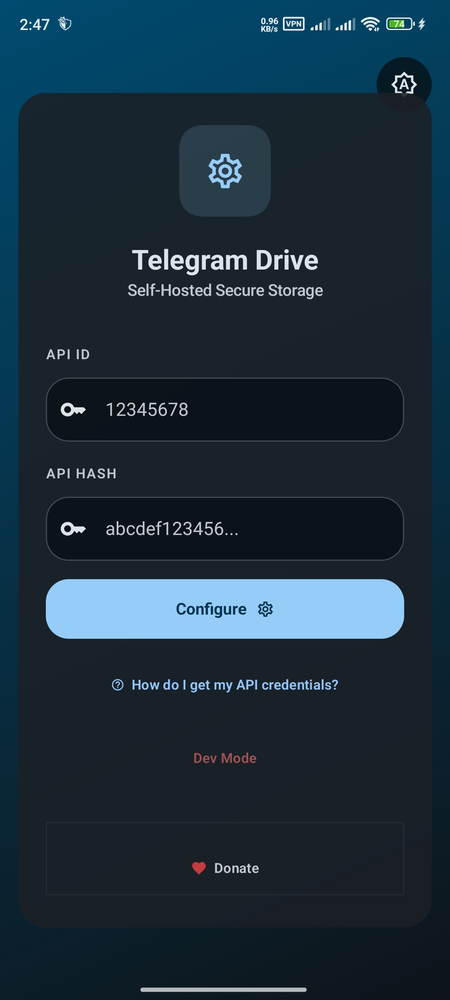
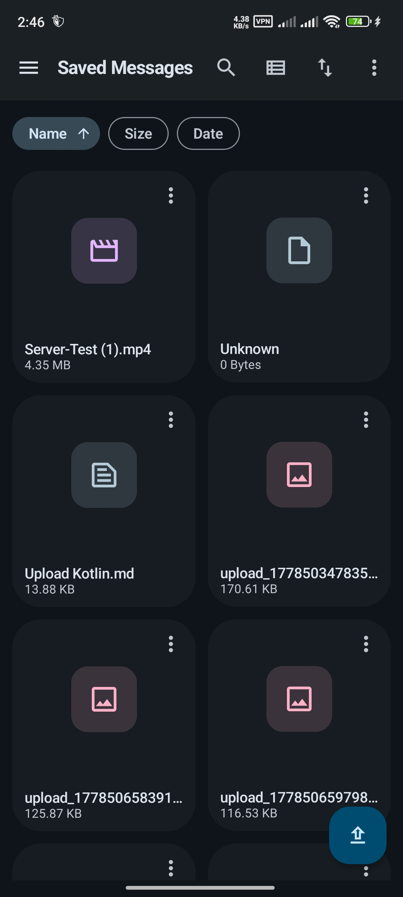
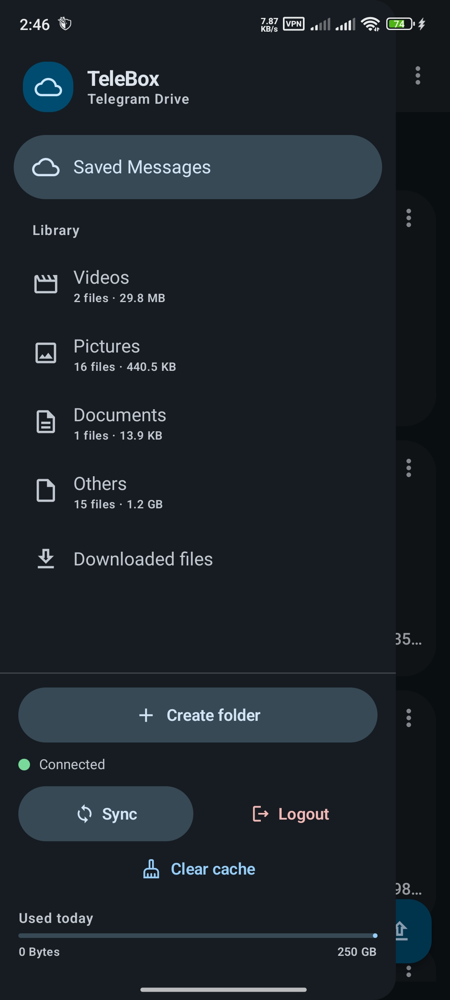

# TeleBox

A native Android application that transforms a Telegram account into a personal cloud storage workspace.

## Introduction

TeleBox provides a modern file management interface backed by Telegram. It allows users to authenticate with their Telegram account, upload and download files, organize content into folders, search stored files, monitor transfers, and preview supported documents and media directly within the application.

The project combines a native Android interface written in Kotlin and Jetpack Compose with a Rust engine responsible for Telegram communication and file operations. Kotlin bindings generated through UniFFI provide a structured bridge between the Android application and the native Rust library.

Key capabilities include:

- Telegram authentication using a phone number or QR code
- Support for Telegram two-factor authentication
- File and folder management
- Upload and download progress tracking
- Global file search
- Grid and list views
- Media playback and document previews
- Local download management
- Light, dark, and system themes
- Responsive layouts for different Android screen sizes

## Screenshots

<table>
  <tr>
    <th>Authentication</th>
    <th>Main Interface</th>
    <th>Sidebar</th>
  </tr>
  <tr>
    <td align="center">
      
    </td>
    <td align="center">
      
    </td>
    <td align="center">
      
    </td>
  </tr>
</table>


## Technology Used

| Area | Technology | Purpose |
| --- | --- | --- |
| Android application | Kotlin | Primary Android development language |
| User interface | Jetpack Compose and Material 3 | Declarative UI and application styling |
| State management | Android ViewModel and Kotlin Flow | Application state and reactive updates |
| Concurrency | Kotlin Coroutines | Asynchronous Android operations |
| Local preferences | Android DataStore | Local application settings and preferences |
| Native engine | Rust | Telegram communication and file operations |
| Async runtime | Tokio | Asynchronous Rust runtime |
| Telegram client | grammers | MTProto communication with Telegram |
| Native interoperability | UniFFI, JNI, and JNA | Communication between Kotlin and Rust |
| Media playback | AndroidX Media3 ExoPlayer | Audio and video playback |
| Image loading | Coil | Image and thumbnail loading |
| QR authentication | ZXing | Telegram login QR code generation |
| Android build system | Gradle | Android dependency and build management |
| Native build system | Cargo and cargo-ndk | Rust compilation for Android targets |
| Automation | GitHub Actions | Automated native and Android builds |

## Local Development

### Requirements

Install the following tools before building the complete project:

- Git
- JDK 17
- Android Studio or Android SDK command-line tools
- Android SDK 35
- Android NDK r26d
- Gradle 8.9
- Rust stable toolchain
- cargo-ndk
- UniFFI Bindgen 0.28.3
- An Android device or emulator running Android 8.0, API level 26, or later

Rust and Android NDK tooling are only required when rebuilding the native engine. The repository includes generated Kotlin bindings and native libraries for `arm64-v8a` devices and `x86_64` emulators.

**Build Instructions**

1. Clone the repository to your local machine:
```bash
git clone https://github.com/RaeesRizwan09/TeleBox.git
cd TeleBox
```

2. Execute the build pipeline script. This script automatically compiles the Rust components and links the generated native libraries directly into the Android project:
```bash
./build_pipeline.sh
```

3. Open Android Studio and select "Open an existing project".
4. Navigate to the `androidApp` directory and select it.
5. Allow Gradle to synchronize all project dependencies.
6. Select your preferred emulator or a connected physical device, then click "Run" to build and launch the application.
